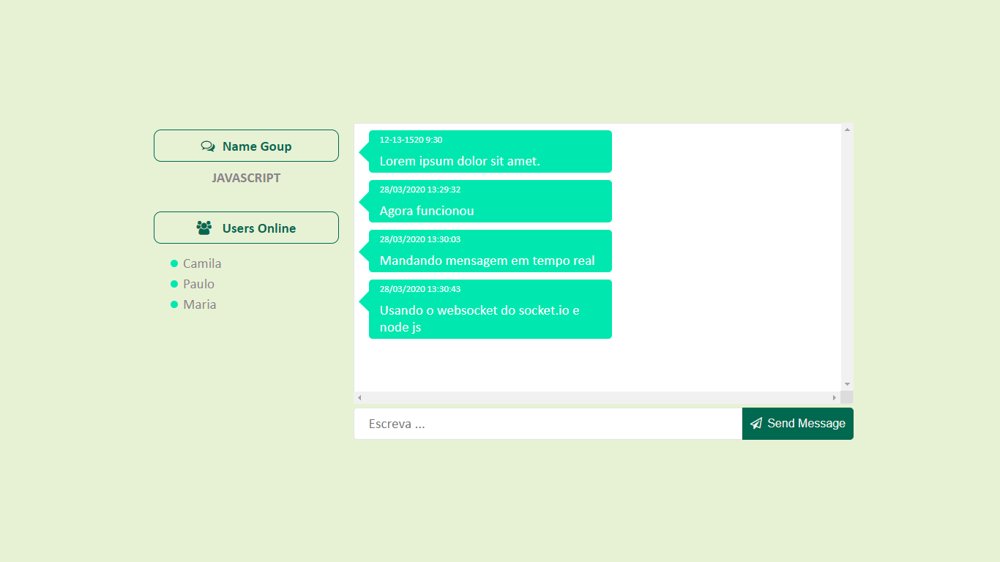

## Chat em tempo real

### Ferramentas utilizadas no desenvolvimento

- Node JS
- Socket.io
- express
- http

### Funcionalidades da aplicação

- Enviar mensagem em tempo real para todos os sockets conectados.
- Conectar varios sockets ao mesmo tempo.
- Enviar e receber mensagem em tempo real.

### Estartando servidor node via terminal

```bash

	npm start	

```

### Template da aplicação

